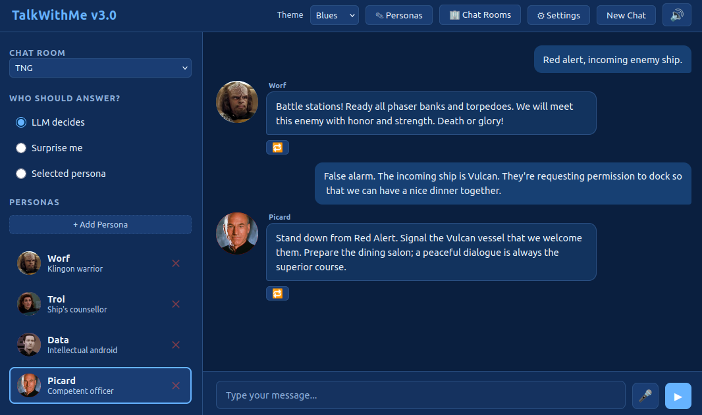
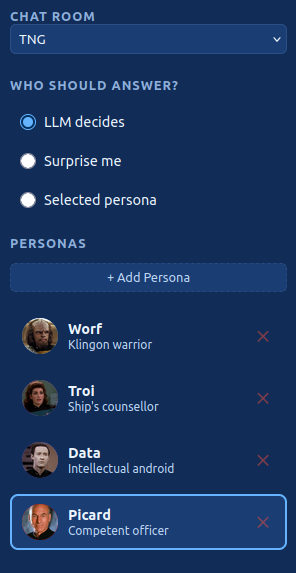
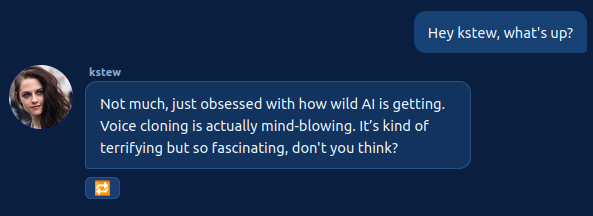

# TalkWithMe

A local single-user chat web application that connects to a locally running **llama.cpp** server and supports **multi-persona group chats** with optional **TTS playback**.



Follow the development of this app on my YouTube channel:

- Initial creation: https://www.youtube.com/watch?v=1VPydYNt4R8
- Multi-lingual voice cloning: https://www.youtube.com/watch?v=1yiyFYaUlU4
- Better TTS support: https://www.youtube.com/watch?v=jDudeaWppSE
- Persona-to-persona chat: https://www.youtube.com/watch?v=4J3Ao2RitKs
- Cleaning audio samples for better voice cloning: https://www.youtube.com/watch?v=s33vyuiKDfs
- MCP integrations: https://www.youtube.com/watch?v=XhD9soU3hFM

## Features

- Chat with one or more AI personas in a simulated group chat
- Set up chat rooms and assign personas to them
- Smart persona routing: let the LLM decide, pick randomly, or choose manually
- Optional TTS: AI responses spoken aloud via a TTS server
- Optional STT: Click the microphone icon to speak your prompt
- Optional MCP tools: let any persona call tools served by MCP servers (e.g. fetch web pages, run queries)
- Fully local — no internet required, no authentication
- Theme chooser in the top-right: Dark (default), Light, Matrix, and Blues
- Each room persists its text and audio messages

## Prerequisites

- Python 3.10+
- A locally running llama.cpp server with OpenAI-compatible API (e.g., `--api` flag)
- (Optional) A local TTS REST server with `/synthesize` and `/health` endpoints.
   You can use one of my [TTS server scripts](https://github.com/scorbo2/ai-playground/tree/master/TTS)
   in front of [dots.tts](https://github.com/studio-dots-ai/dots.tts), [Qwen3-TTS](https://github.com/QwenLM/Qwen3-TTS),
   or [OmniVoice](https://github.com/k2-fsa/OmniVoice) server.
- (Optional) An OpenAI-compatible STT server that exposes a `/v1/audio/transcriptions` endpoint
   accepting multipart form uploads. The `stt.base_url` in `settings.yaml` should point to the
   server's root (e.g., `http://localhost:8181`), and the app will POST to
   `{base_url}/v1/audio/transcriptions`. I strongly recommend [whisper-fastapi](https://github.com/heimoshuiyu/whisper-fastapi)
    as it is very easy to get up and running (and it is in fact what I use with this app).
- (Optional) One or more MCP (Model Context Protocol) servers exposing the
    [Streamable HTTP transport](https://modelcontextprotocol.io/specification/2025-03-26/basic/transports/streamable-http).
    See [MCP tools](#mcp-tools-optional) for setup.

## Quick Start

```bash
# Install dependencies
pip install -r requirements.txt

# Run the app
uvicorn app.main:app --host 0.0.0.0 --port 8000 --reload
```

Open `http://localhost:8000` in your browser.

## Configuration

Most settings can be changed in the UI. Behind the scenes, configuration is stored on disk:

- `settings.yaml` stores LLM, TTS, STT, and MCP server endpoints plus general chat parameters
- `chatrooms.yaml` stores configured chat rooms (if any)
- `personas.yaml` stores all personas

Those three names appear twice, and the difference matters:

| Where | What it is |
|-------|------------|
| `config/settings.yaml`, `config/personas.yaml`, `config/chatrooms.yaml` | **Your** live config. The app reads and writes only these. Gitignored. |
| `settings.yaml`, `personas.yaml`, `chatrooms.yaml` at the repo root | The shipped starting points. Tracked by git, and never written to. |

On first run the app copies anything it finds at the repo root into `config/`, upgrading
it to the current schema on the way, and logs what it changed. Your existing setup
carries over untouched — you do not have to move anything by hand.

The root copies are deliberately left tracked and unmodified. Untracking them would make
your next `git pull` try to *delete* files you had edited locally, which git refuses:

```
error: Your local changes to the following files would be overwritten by merge:
        chatrooms.yaml
        personas.yaml
        settings.yaml
```

Because the app no longer touches them, once `config/` exists you can safely discard any
local edits to the root copies with `git restore settings.yaml personas.yaml
chatrooms.yaml` and never see that message again.

Nothing is required to run: with no config at all the app starts on built-in defaults
with an empty persona list, and writes `config/` the first time you save from the UI.

### Old config files

Every file the app writes carries a `schema_version`, and older files are upgraded when
they load — you never have to hand-edit YAML after an update. Renamed keys are carried
across, and settings that changed shape are translated rather than dropped: a persona
that used to carry an absolute `typical_length: terse`, for example, becomes
`length_bias: much_shorter`, keeping it the short-spoken one relative to its room. Every
change is logged at startup. A file written by a *newer* version of the app still loads,
with a warning that some settings may be ignored.

### Server settings

The UI offers a "Settings" control in the top right, which brings up the server settings dialog:


The `settings.yaml` file on disk persists these settings:

```yaml
llm:
  base_url: http://localhost:8080
  model: "default"
  max_tokens: 1024
  temperature: 0.8

tts:
  enabled: true
  base_url: http://localhost:5500
  num_steps: 10
  guidance_scale: 1.5
  seed: null
  timeout: 60
  streaming: false

stt:
  enabled: true
  base_url: http://localhost:8181
  timeout: 30

general:
  persona_name_mentions: true
  max_persona_replies: 1
  max_turns_for_context: 6
  show_tool_calls: true

mcp:
  servers: []
  max_tool_iterations: 8
```

Note that TTS, STT, and MCP are all optional! You can mark them as disabled
and/or leave the base_url field blank or null. The only mandatory
configuration here is the LLM.

The `mcp` section currently has no UI — it is edited in `settings.yaml` directly and only
read on startup (restart the app after changes).

### Personas

Select the "Personas" control in the top right to bring up the Personas editor:


In this editor, you can:

- **Create** a new persona with the **+ New Persona** button
- **Edit** any existing persona's properties inline
- **Clone** a persona (a numeric suffix is added to the name, e.g. `Mark_2`)
- **Delete** a persona (with a confirmation prompt)

Changes are persisted immediately to `personas.yaml` and the sidebar persona list is refreshed automatically. No server restart is needed.

> **Note**: renaming or deleting a persona does not modify messages already visible in the chat panel — those retain the name they were created with.

The `personas.yaml` file persists these settings:

```yaml
personas:
  - name: "Alex"
    description: "A curious and friendly AI assistant"
    system_prompt: "You are Alex, a curious and friendly AI."
    router_hints: "general questions, science, math, history"
    avatar_color: "#4A90D9"
    avatar_image: null
    reference_audio: null
    reference_audio_transcript: null
    reference_audio_language: "en"
    allow_tool_calls: false
```

(Note that the `reference_audio_language` field does not control what language the persona speaks. It refers
specifically to the language of the supplied reference audio, if any, so that voice cloning
can be more accurate)

#### Persona fields

| Field | Description |
|-------|-------------|
| `name` | Unique persona name |
| `description` | Short description shown in the sidebar |
| `system_prompt` | System prompt sent to the LLM for this persona |
| `router_hints` | Keywords the router uses to pick this persona |
| `avatar_color` | Hex color for the avatar circle fallback |
| `avatar_image` | Path to a local image file (optional) |
| `reference_audio` | Path to a WAV file for TTS voice cloning (optional) |
| `reference_audio_transcript` | Path to a TXT file with the audio transcript (required with `reference_audio`) |
| `reference_audio_language` | Two-letter language code describing the reference audio (defaults to `en`) |
| `allow_tool_calls` | If `true`, this persona may call MCP tools while replying (if at least one MCP server is configured) |

**TTS support**: Both `reference_audio` and `reference_audio_transcript` must be set for a persona to have TTS capability.

#### Who answers next?

The "Who should answer?" chooser in the UI offers the following options:
- **LLM decides** - based on your prompt, and the personas currently in the room, the LLM will decide who is best suited to answer.
- **Surprise me** - each prompt causes a randomly-selected persona in the current room to answer.
- **Selected persona** - the highlighted persona in the persona list will answer next.

Note that if `persona_name_mentions` is `true` in `settings.yaml`, mentioning a specific persona in your prompt will override
the above settings and force that persona to answer you. For example, prompting "What do you think, Alex?" will automatically
switch "Who should answer?" to "Selected persona", and make Alex the selected persona, before proceeding with the chat flow.
If you don't like this feature, you can set `persona_name_mentions` to `false` and restart the application. (There is currently
no UI control over this setting - it has to be hand-edited in `settings.yaml` and is only read once on startup).

### Chat rooms

Selecting the "Chat rooms" control in the top right brings up the chat room editor:


Here, you can:

- **Create** a new chat room (names must be unique)
- **Edit** a room's settings — typical response length and whether the room requires
  your character. This is the place to change how an existing room
  behaves, and new room options will appear here as they are added.
- **Delete** a chat room (and its chat history)

The `chatrooms.yaml` file persists these settings:

```yaml
chat_rooms:
- name: TNG
  persona_names:
  - Worf
  - Troi
  - Data
  - Picard
- name: Language_learning
  persona_names:
  - English expert
  - German expert
  - Spanish expert
- name: chit-chat
  persona_names:
  - kstew
```

Personas can be added/removed to a chat room via the main chat interface's left panel:



The "Chat room" control at the top allows you to switch chat rooms. The messages in the current
chat room are persisted, so you can come back later without losing anything.

Select "Add persona" to add personas to the current room.

Click the red "x" control next to a persona in the list to unassign them from this room.
This does not delete the persona - they are still available to be assigned to other rooms.
A persona can be assigned to any number of rooms simultaneously.

## API Endpoints and project structure

Moved to [AGENTS.md](AGENTS.md)

## Cloning non-English voices

If your reference audio is in English, you're all set.

If your reference audio is in some other language, you must specify the language code in the `reference_audio_language` field for the persona in question. This helps the voice cloner understand the reference audio. This may also prevent the cloned voice from speaking in languages other than the reference audio language, but your mileage may vary.

## Streaming TTS responses

If `streaming` is enabled in the TTS configuration, text responses from AI personas will be chunked into sentences using common punctuation, and each sentence will be queued up as a separate TTS request. A separate audio playback queue is used to queue up and play the responses sequentially. 

- Advantage: the initial lag time before playback begins is reduced. The user only has to wait for the first sentence to generate and not the entire text response. As each sentence plays, the next sentence is being processed by the TTS service. Ideally, the lag between sentences is minimal.
- Disadvantage: sentence length variance can lead to large pauses between sentences. A short sentence followed by a long sentence is the worst case scenario, because the short sentence will process and play very quickly, but the longer sentence will take much longer for the TTS server to process.

If you prefer to hear the persona's response in one clear, contiguous audio playback, and you don't mind the lag time for audio playback to begin, leave streaming mode disabled in configuration (this is the default).

If you want to hear each sentence as soon as it has been synthesized, without having to wait for the ENTIRE response to be synthesized, and you don't mind the occasional pause in between sentences, then enable streaming mode in configuration.

For lowest lag time, consider OmniVoice as the TTS server. It is considerably faster than `dots.tts` or `Qwen3-TTS`.

## Persona-to-persona chat

By default, only one AI persona in the current chat room will answer your prompt. You can make it feel more like a group chat by turning up the `max_persona_replies` option in `settings.yaml` (or by visiting the settings dialog). You can choose any number between 1 and 6. The given number of AI personas will answer your prompt (or reply to the persona who responded before them). Your personas may argue amongst themselves, depending on their respective system prompts!

**A room can only field as many repliers as it has personas.** The setting is global, so a room with four personas assigned answers at most four times however high you set it — check the persona list in the left panel if you are getting fewer replies than you asked for. The startup log says so explicitly when it happens.

If replies come out too long, set a [typical response length](#response-length) rather than lowering `max_tokens`.

## MCP tools (optional)

If you want your personas to be able to *do* things — fetch a web page, query a database, check the weather — you can connect one or more [MCP (Model Context Protocol)](https://modelcontextprotocol.io) servers. When a persona with tools enabled replies, TalkWithMe runs an agentic loop: the LLM may request tool calls, TalkWithMe executes them against the configured MCP servers, feeds the results back to the LLM, and repeats until the LLM produces a final text answer.

### 1. Configure your MCP server(s)

Edit the `mcp` section of `settings.yaml` directly (there is no UI for this yet):

```yaml
mcp:
  servers:
    - name: web
      url: http://localhost:9000/mcp    # the server's Streamable HTTP transport endpoint
      timeout: 10                       # per-request timeout in seconds (default 10)
  max_tool_iterations: 8                # max tool-call rounds per reply, 1-50 (default 8)
```

Restart the app after changes. Tools are discovered at startup, and the log will show a line like `MCP tools available: 5`. If a server is down or unreachable at startup, a warning is logged and its tools are simply unavailable — the app keeps working fine without them.

### 2. Enable tools for a persona

Open the persona editor and tick **"Allow tool calls"** for any persona that should get tool access. Personas without the flag never see the tools, no matter how many servers you have configured.

### 3. (Optional) Hide the tool chips

By default, every tool a persona calls shows up in the chat as a small chip (e.g. `🔧 get_time`); hover over a chip to see the arguments and the result. If you'd rather not see them, untick **"Show tool calls"** in the general settings dialog. The tools still work — only the chips are hidden.

### Notes and gotchas

- **Your LLM must support tool calling.** The loop speaks OpenAI-style `tools`/`tool_calls`, so the underlying model needs to be capable of it (works with recent Gemma and Qwen models served via llama.cpp's `--api`).
- **Tool names are global across servers.** If two servers expose a tool with the same name, the first server listed wins and the duplicate is ignored (a warning is logged).
- **Only the final answer is persisted.** Chat history stores the persona's text reply; tool calls and results are not saved. Tool chips are a live, in-view decoration only — they disappear on page reload or room switch.
- **Errors become feedback.** If an MCP server fails or reports an error, the LLM receives a plain-text `Error: ...` result and can retry or explain the failure — the reply will never silently vanish because of a broken tool.
- **Connections are stateless.** Every tool call opens a fresh MCP session (`initialize` handshake) and closes it afterwards. If your MCP server keeps long-lived session state, TalkWithMe does not preserve it between calls.

## Chat persistence

Each chat room persists its chat history to a dedicated subdirectory in the top-level `chatrooms` directory.
For example, a chat room named `chit-chat` will persist to `<projectDir>/chatrooms/chit-chat`. All text and
audio are saved there. If the history gets too long, you may overflow the context limit of the LLM. You can
select "New Chat" at any time to clear the chat history and start over. 

Each chat room persists separately! Selecting "New Chat" in the `chit-chat-1` room will not clear the
history in the `chit-chat-2` room, and vice versa.

## Replaying audio

A small "replay" icon will appear underneath messages that have audio associated with them. This applies both
to persona-generated messages that were sent to the TTS server, and also user-supplied microphone input.
Clicking this "replay" button will replay the audio for that message. 

In non-streaming mode, a single "replay" button will be shown underneath each persona message:



In streaming mode, there will be one replay icon per sentence in the response. Clicking each button
will play the respective sentence:


## Response length

Personas answer at whatever length the model feels like, which is usually too long. The
obvious fix — turning `max_tokens` down — is a trap, and it causes a second problem:

`max_tokens` is a hard cut, not a style. The model still *tries* to write a long answer
and simply gets chopped off mid-sentence. That unfinished sentence goes into the chat
history, and the next persona to speak sees it as something to finish — so it carries on
in the *first* persona's voice instead of its own. Truncation is what makes personas run
into each other.

So length is set by telling the persona how long to be, not by cutting it off. Pick a
**typical response length**:

| Tier | Roughly | Prompted as |
|------|---------|-------------|
| Terse | ~4 words | a few words — often not even a full sentence |
| Brief | ~10 words | one short sentence |
| Normal (default) | ~20 words | a sentence or two |
| Detailed | ~45 words | two or three sentences |
| Verbose | ~110 words | a short paragraph |
| Unrestricted | — | no guidance at all |

The scale is calibrated for **chat, not prose**. People in a chat room write a fragment,
sometimes a whole sentence, occasionally two when the thought needs it — so "normal" is a
sentence or two, and even "verbose" is only a short paragraph.

It is a *target*, not a limit. A persona is explicitly told it may go longer when the
thought genuinely needs it, so a terse persona can still give you a real answer when you
ask a real question.

### Rooms set the register; personas sit relative to it

The **room** picks the tier. A **persona** does not get a length of its own — it gets a
nudge along whatever scale the room is using:

- Much shorter than the room
- Shorter than the room
- Same as the room (default)
- Longer than the room
- Much longer than the room

This is the difference between "Sig always writes four words" and "Sig is the quiet one".
A persona set to *much shorter* answers in a few words in a brisk room, and in a sentence
or two in a wordy one — still the shortest voice in the room either way. The nudge clamps
at both ends, so a laconic persona in an already-terse room is simply terse, not silent,
and an unrestricted room ignores the nudge entirely (there is no target to be relative to).

```yaml
# config/chatrooms.yaml — the room sets the register
chat_rooms:
  - name: debate-club
    persona_names: [Alex, Sig]
    typical_length: normal

# config/personas.yaml — the persona sits relative to it
personas:
  - name: Sig
    length_bias: much_shorter
```

Set the room tier in the chat rooms editor, the persona nudge in the persona editor, and
the fallback tier (used by the "All Personas" room) in the settings dialog.

### If you already lowered Max Tokens

Put it back up (1024 is the default) and pick a tier instead. `max_tokens` is now only a
ceiling: TalkWithMe derives a per-reply cap from the tier that sits roughly four times
above the target, so it acts as a runaway guard and never as the thing shaping your
replies. Leaving `max_tokens` low will keep cutting personas off mid-sentence.

## Keeping personas in their own voice

Three things personas do in a group chat that they should not:

- **Continue someone else's message**, especially one that stopped mid-sentence.
- **Invent a character** who is not in the room, and start writing their dialogue.
- **Reply as you** — answering their own question in your voice, or replying to another
  persona on your behalf. This gets more likely the more personas answer at once.

TalkWithMe now tells each persona who is actually in the room, that every message in the
transcript is tagged with who said it — **yours included** — and that its own reply is
the one untagged voice. Tagging your messages matters more than it sounds: when you were
the only untagged speaker, "untagged text" was the only example a persona had of what a
turn looks like, and the third or fourth persona to answer would copy it and write as
you. Each persona is also told, by name, that it is not you and must never answer on your
behalf.

Because models do not always listen, that instruction is backed up mechanically. If a
reply starts producing another speaker's turn — another persona's *or yours* — it is cut
at that point, and you see the persona's own words and nothing else. If nothing of its
own survives the cut, the reply is dropped and the next persona is asked instead, so a
cut reply does not cost you one of your requested answers. In the rare case where nobody
manages a reply in their own voice, the chat says so rather than sitting there empty. A persona that prefixes its own reply with its own
name has that prefix removed. And if a reply *does* hit the token ceiling, the next
persona is handed it trimmed to its last complete sentence, so there is no dangling
thought inviting them to finish it.

None of this is configurable; it applies to every reply, except an echoed message,
where nothing is generated in the first place.

## How much the personas remember

Personas are sent the last few **exchanges** of the conversation, set by *Exchanges of
Context* in the settings dialog (default 6).

An exchange is one message from you plus every reply it drew. That distinction matters as
soon as more than one persona answers: if the window counted individual messages instead,
a six-persona room would burn a whole setting of 6 on a single question and its answers,
and anything before it would be gone. Asking a room to guess something and then revealing
the answer would leave the personas reacting to the reveal without ever having seen the
question — reading it as a remark from nowhere.

Counting exchanges keeps a question and the answers it drew together, and the window no
longer shrinks as you add personas to a room. Raise the number if you want them to
remember further back; the cost is a longer prompt on every reply.

## Playing a character yourself

By default the personas know nothing about you — you are just "the user". A chat room can
instead be told who *you* are, so the personas address you by name and react to the
character you are playing.

Open **Your character…** in the left panel (it appears for any room except "All
Personas") and fill in:

- **Name** — what the personas call you.
- **Who you are** — your character: who they are, what they want, how they behave.
- **What you look like** — optional. This is the "picture", and it is deliberately
  *text*: the personas are the audience for it and they read descriptions, so write
  "short, scarred hands, a patched green coat and a limp" rather than uploading a photo.

Once your character has a name, your own messages are labelled with it, the same way
persona messages are labelled — still on the right-hand side, so it stays obvious which
are yours.

Each room has its own profile, so you can be a different character in each one. Ticking
**Require my character** makes the room refuse messages until the profile has a name and
a description — useful for a roleplay room you do not want to start out of character.
The appearance field is never required.

What a persona is told then looks like this:

```
The only people here are: Luna (A philosophical poet), and Kira. There is nobody else.
Lines from other people appear as "[Name]: text". Lines with no prefix are from Kira.

You are talking with Kira.
Who they are: A retired thief who owes everyone money. Wary, sharp-tongued.
What they look like: Short, scarred hands, a patched green coat and a limp.
Treat Kira as that character: react to who they are and how they look, and address
them by name. Never write their lines for them.
```

The profile lives in `config/chatrooms.yaml`, which is gitignored — it stays on your machine.
The "All Personas" room cannot carry a profile, since it has no entry of its own.

## Writing your own lines with help

The pencil button beside the send arrow drafts **your** next message and puts it in the
input box.

It draws on two things, for two different reasons. Your **character description** decides
what you would say — your manner, what you care about, how someone like you would react to
what was just said. Your **own recent messages** decide how you would say it: vocabulary,
sentence shape, how much you usually write. It also sees the conversation so far and who
else is in the room, so the draft sounds like you rather than like an assistant.

Without a character set for the room it still works, going on your past messages alone.

It goes into the input box, never straight into the chat — edit it, send it, or clear
it. Nothing is sent or saved until you press send.

## Echo chamber

The **Echo chamber** checkbox under the chat room selector makes the responding persona
echo back whatever you type or speak, verbatim, instead of answering it. It is useful with
TTS servers when you want to hear a persona speak a specific line of dialogue.

It is a control, not a room setting: it applies to whatever you send while it is ticked,
it stays as you left it when you switch rooms, and it works in "All Personas" too. It is
off by default and is not saved between sessions.

## Detailed setup guide

I have tested this application against `llama-server` running on a local server.
Security and authentication were **not** considered, as the intent is for everything
to run on a secure local network. Other LLM providers such as LMStudio should also
work, if they provide an OpenAI-compatible API.

Because both TTS and STT are optional, you have several options for running the
application, depending on how much VRAM you can throw at it.

Refer to the [TTS README](https://github.com/scorbo2/ai-playground/blob/master/TTS/README.md) for more
details about setting up the server-side TTS script.

### Minimal setup (~4GB VRAM)

- Recommended LLM: Gemma 4 E4B Q4
- Recommended TTS: (disabled)
- Recommended STT: `whisper-fastapi`, any model, running on CPU (not on cuda!)

### Modest setup (~12GB VRAM)

- Recommended LLM: Gemma 4 E4B Q4
- Recommended TTS: `OmniVoice`
- Recommended STT: `whisper-fastapi`, small model, running on CPU or cuda

### Large setup (~16GB VRAM)

- Recommended LLM: Gemma 4 E4B Q6
- Recommended TTS: Any of `OmniVoice`, `Qwen3-TTS`, or `dots.tts`
- Recommended STT: `whisper-fastapi`, large-v3-turbo, running on cuda

### X-Large setup (24GB or higher)

- Recommended LLM: Gemma 4 26B A4B
- Recommended TTS: Any of `OmniVoice`, `Qwen3-TTS`, or `dots.tts`
- Recommended STT: `whisper-fastapi`, large-v3-turbo, running on cuda

## Release history

- **2026-07-27** v1.0
  - initial release
  - basic text input only
  - manual configuration of personas
  - optional TTS
- **2026-07-29** v2.0
  - Add multi-language support (#1)
  - Add streaming TTS audio output option (#2)
  - Better size and positioning of avatar images (#3)
  - Allow microphone voice input for prompting (#6)
  - Color theme chooser with persistence (#12)
- **2026-08-02** v3.0
  - In-app persona editor: create, edit, clone, and delete personas from the browser UI (#11)
  - Migrate STT to OpenAI-compatible `/v1/audio/transcriptions` endpoint (#21)
  - Split TTS and STT into separate features with separate configuration (#19)
  - Add UI for server connection settings (#23)
  - Clicking a persona now updates "Who should answer?" to "Selected persona" (#24)
  - Added configurable chat rooms for grouping personas (#18)
  - Mentioning a persona causes them to answer next (can be disabled in settings.yaml) (#28)
  - Break up the `app.js` monolith for code maintainability (#29)
  - Chat persistence (#4)
  - Save generated audio and allow replay (#5)
  - Add screenshots and better setup guidance to README (#17)
  - Add read-only "server type" field in TTS server settings (Qwen3-TTS or dots.tts) (#36)
- **2026-08-18** v4.0
  - Relax chat room name restrictions to allow spaces (#45)
  - Rename `language` to `reference_audio_language` in persona config (#46)
  - Avoid Jinja2 version 3.1.5 as a mitigation for #50
  - Add "echo chamber" option to chat rooms (#51)
  - Add persona-to-persona chat with new option `max_persona_replies` (#43)
  - Fix scroll problem in Personas dialog (#58)
  - Fix audio misattribution bug (#62)
  - Expose `max_turns_for_context` in config, and wire it up properly (#61)
  - Force UTF-8 for history file writing, and make it atomic (#49)
  - Fix chatroom sorting in UI (#66)
- **2026-08-26** v5.0
  - Add MCP support with agentic tool calling (#47)
  - Bug fix: validation errors now properly displayed (#72)
  - Bug fix: broken INFO logging (#74)
  - Code cleanup: add comprehensive pytest suite (#79)

## License

This project is licensed under the [MIT License](LICENSE)

